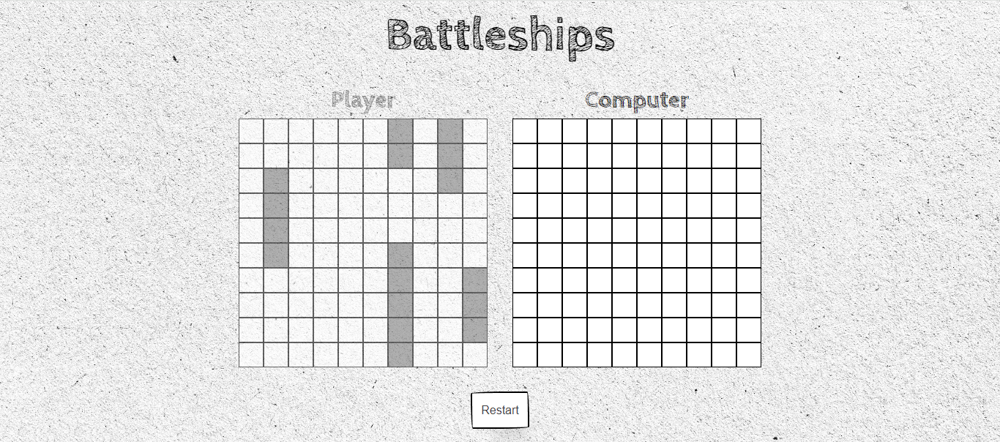
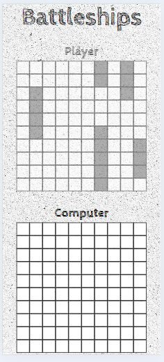

# Battleship - The Odin Project

## Objective

We're going to implement the classic game 'Battleship' using Test Driven Development (TDD) to create the game's functionality. The main premise is for one Real player and one Computer player to battle against each other, using the restart button to randomly add ships to the board.

## Model

### Index

| Desktop                                     | Mobile                                    |
| ------------------------------------------- | ----------------------------------------- |
|  |  |

Creating a function solely off TDD was a new path and such an eye-opener for stepping through a large problem and breaking it down into much more manageable pieces. Using classes for the main running of the game was a great way to access the functions throughout the app and to easily run through the flow of the game, switching between players' turns, checking for 'Hits' and 'Misses', and checking for sunken boats.

I have fond memories of the game from childhood trips with my family, using a notepad to draw out the board and a pencil to mark 'hits' and 'misses' while playing. So, I went for the same design with this app, using a paper-style theme with the `CabinSketch` font, which was perfect to meld the theme and font together.

The main functionality is separated into different classes and modules:

- **Ship**
  - Handles the individual ship, taking a ship length and hit counter. It has methods to update the hit counter when the boat is hit and to check if the boat's hits and length are equal, signifying that the boat is sunk.
- **Player**
  - This class handles the type of player, and each one is attached to its own `Gameboard`, which keeps track of the `Player's` ships and their placement on the board. It also stores the method for displaying the board (a 2D array) on the table shown to the user.
  - The `reset` method is called to add a new `Gameboard` to the Player, so when the game is restarted, the player has a new board.
  - The `randomize` method handles the randomizing of the player's boats on the board, ensuring the length is within bounds and that ships don't overlap.
- **Gameboard**
  - This class mainly handles the creation and storage of the player's gameboard. When initialized, it creates a 10x10 2D Array to store the ships when they're randomly assigned an index on the gameboard.
  - The `placeBoat` method handles the placement of randomly generated ships, ensuring spaces are clear and managing ship direction. It returns either `true` or `false` when completed.
  - `receiveAttack` takes the index of the attack and checks whether the cell is empty or not. It then uses the `Ship` hit method to add to the ship's hit counter.
  - `isBoatsSunk` checks the player's gameboard, and if all boats are sunk, it returns `true`.
- **GameFlow**
  - This class handles the entire flow of one game, tracking the 2 players involved and keeping track of who is active and who is the opponent.
  - The `initialize` method creates a whole new board and displays the boards on the user's screen.
  - `switchPlayerTurn` and `switchOpponentTurn` handle which player's turn it is and who will take hits from the active player. If the `activePlayer` is the computer, the `computerRound` method is called.
  - `computerRound` handles the computer's automatic turn, creating a random valid index on the board and playing the turn against the opponent player.
  - `playRound` is the bulk of the `GameFlow`. It handles each round, taking `row` and `col` arguments to fire the `receiveAttack` method from `Gameboard`. This returns true or false depending on a hit or miss. For a 'hit', it also runs `isBoatsSunk` to check if all boats are sunk and the player has won. With each attack, the cell in the table is given an emoji to signify a 'miss' or a 'hit'. If a player wins, a `dialog` opens to display the winner and show the restart button for a new game.
  - The `restartGame` method runs `clearBoard` to clear the `td` on the user's screen, then initializes a new `GameFlow` and `Gameboard` for both players and closes the `dialog`.

Running tests for all these methods and functions was great for peace of mind when adding or removing other elements. Using TDD was excellent for covering all bases when creating functions after writing the tests.

## Problems Encountered

- How to stop clicking on the opponents board.
- Keeping track of the Game Flow.
- Centering a Dialog.
- Creating a 2D array with Array prototypes.
- Getting the cell co-ordinates from the table.
- Switching active player during the game flow.

## New Skills Acquired

- Using `pointer-events: none` to stop any clicking on the grids when not the active player.
- Placing the Game Flow into a class and adding the players to then cycle through the game flow with ease using methods.
- Using `margin: auto;` to center the dialog on the document.
- `fill()` and `map()` to create a 10 x 10 2D array to keep track of the ships.
- Applying each cell with a Co-ordinate and then using `String.substring(index.length -3)` to just get the 2D array index. Using `String.charAt()` to separate the index out into `row` and `col`.
- Ternary operators were ideal when using two conditionals, which easily switch players when the function was called.

## Technologies Used

- HTML
- CSS
- JavaScript
- Webpack
- Jest
